# Лабораторная работа №7. Адаптивная верстка: Flexbox

## ФИО студента: [ Рыхлюк Надежда]
## Группа: ISP-233

---

## Цель работы
Освоить современные технологии CSS-разметки — Flexbox для создания адаптивных веб-страниц.

---

## Теоретическая часть

### Что такое адаптивная верстка?
Адаптивная верстка — это подход к созданию веб-страниц, при котором дизайн и контент автоматически подстраиваются под размер экрана устройства (компьютер, планшет, смартфон).

### Что такое Flexbox?
Flexbox (Flexible Box Layout) — это одномерная система компоновки для размещения элементов в строку или столбец. Идеально подходит для:
- Выравнивания элементов по горизонтали или вертикали
- Распределения свободного пространства
- Создания навигационных меню
- Центрирования элементов

### Основные концепции
- **Flex-контейнер** — родительский элемент с `display: flex`
- **Flex-элементы** — дочерние элементы внутри контейнера

---

## Практическая часть

### 1. Свойство `flex-direction`
Определяет направление расположения элементов.

| Значение | Описание |
|----------|----------|
| `row` | Элементы в строку (→) |
| `row-reverse` | Элементы в строку справа налево (←) |
| `column` | Элементы в столбец (↓) |
| `column-reverse` | Элементы в столбец снизу вверх (↑) |

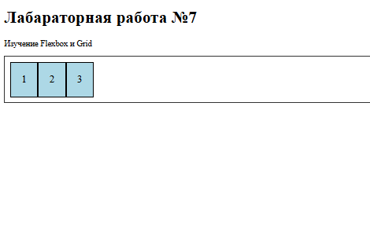
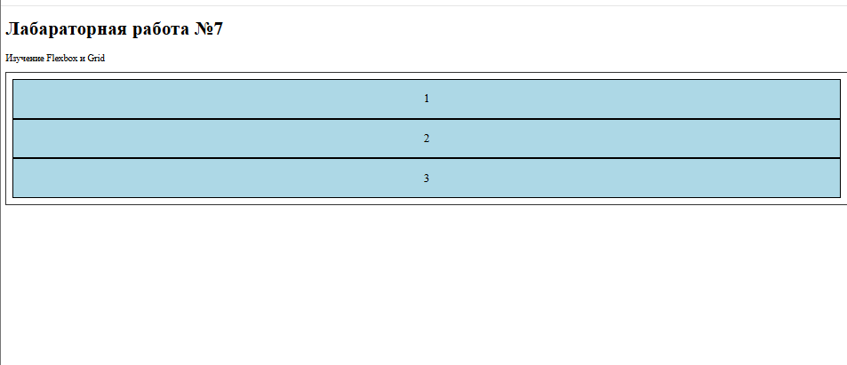
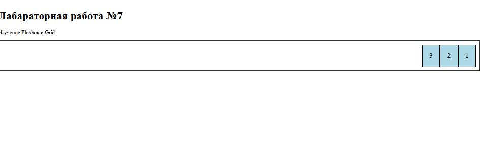

---

### 2. Свойство `justify-content`
Выравнивание элементов по главной оси.

| Значение | Описание |
|----------|----------|
| `flex-start` | В начале (по умолчанию) |
| `flex-end` | В конце |
| `center` | По центру |
| `space-between` | Равномерно, первый и последний у краёв |
| `space-around` | Равномерно, с отступами по краям |
| `space-evenly` | Равномерно, одинаковые отступы везде |

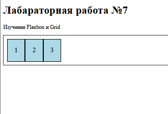
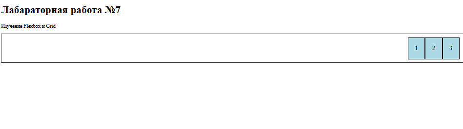
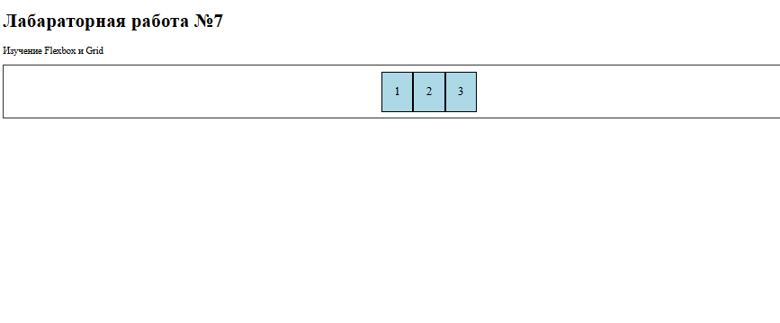
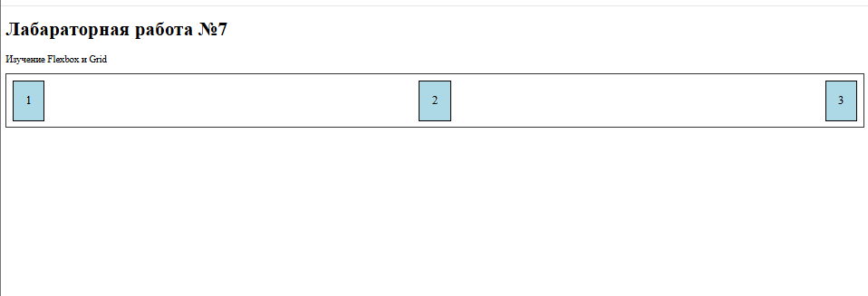
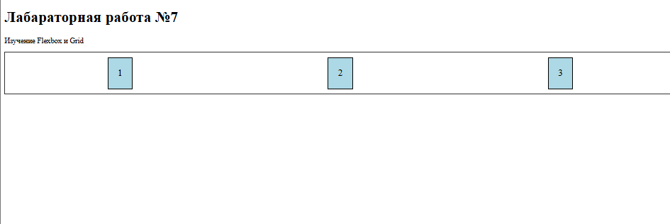
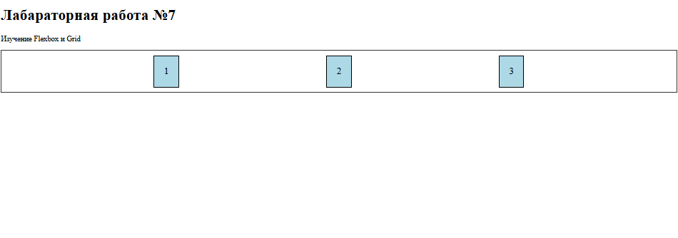

---

### 3. Свойство `align-items`
Выравнивание элементов по поперечной оси.

| Значение | Описание |
|----------|----------|
| `stretch` | Растягивает элементы (по умолчанию) |
| `flex-start` | В начале |
| `flex-end` | В конце |
| `center` | По центру |
| `baseline` | По базовой линии текста |

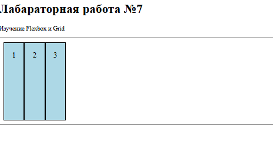
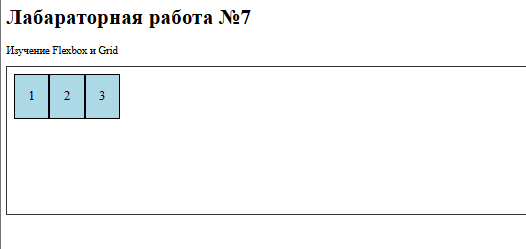
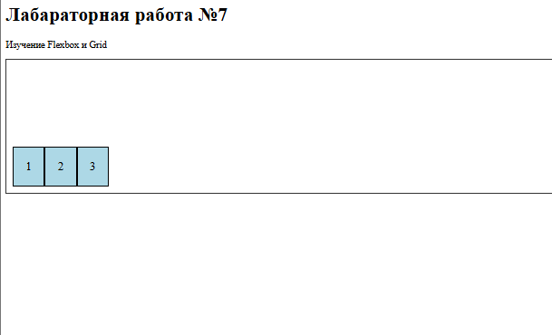
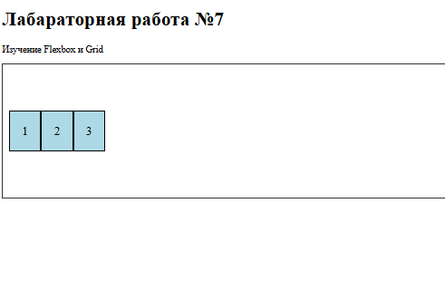
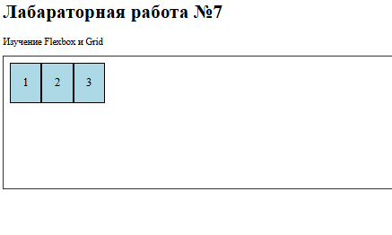

---

### 4. Свойство `flex-wrap`
Управление переносом элементов на новую строку.

| Значение | Описание |
|----------|----------|
| `nowrap` | Без переноса (по умолчанию) |
| `wrap` | Перенос на новую строку |
| `wrap-reverse` | Перенос в обратном направлении |

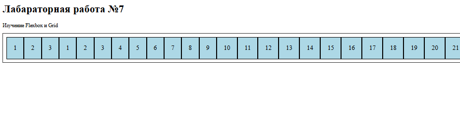
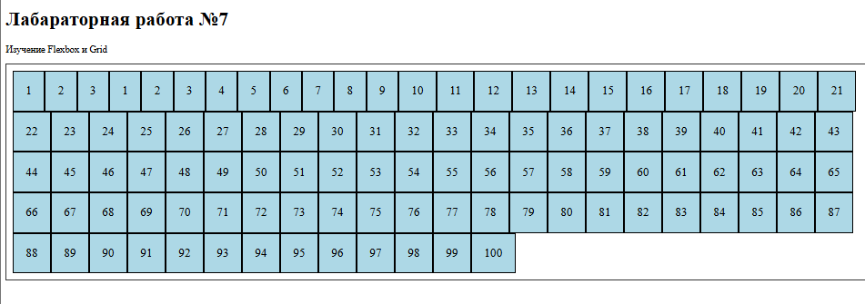
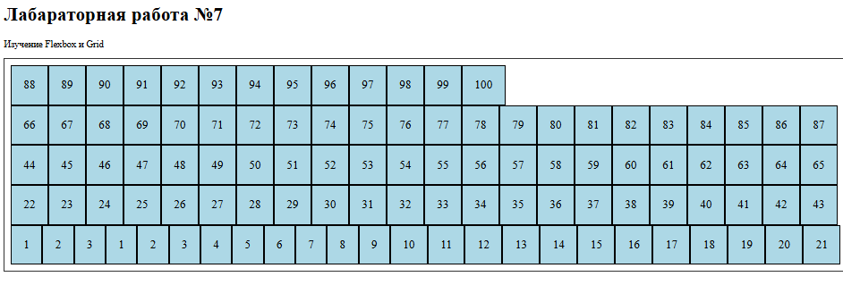

---

### 5. Свойство `gap`
Отступы между элементами.

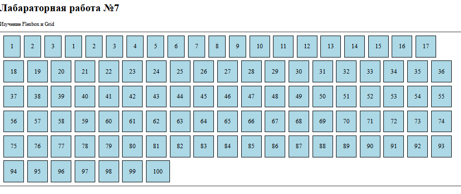

---

### 6. Свойство `flex-grow`
Растягивание элемента для заполнения свободного пространства.

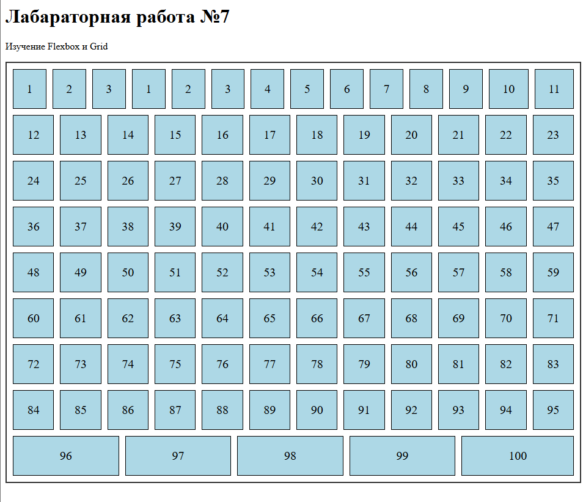
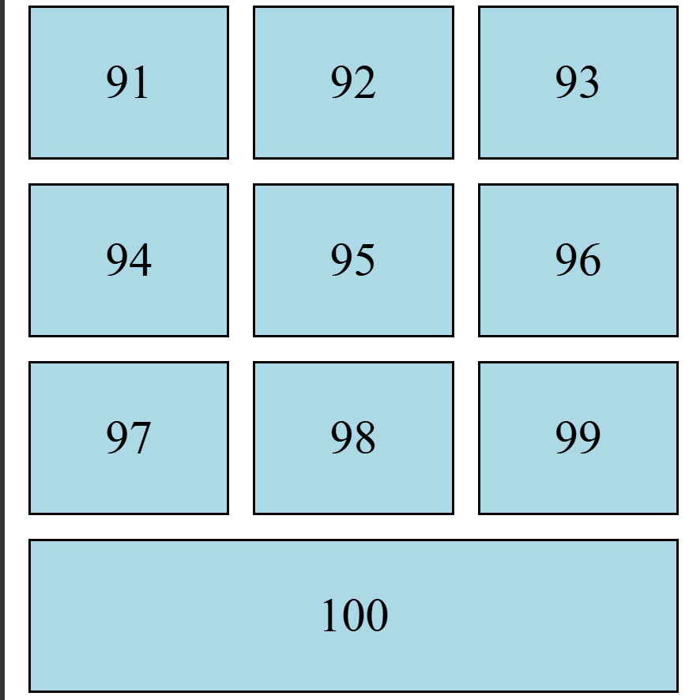

---

### 7. Практические примеры

#### 7.1. Навигационное меню
Горизонтальное меню с использованием Flexbox.

---

#### 7.2. Карточки товаров
Адаптивные карточки с переносом на новую строку при уменьшении экрана.

---

#### 7.3. Центрирование элемента
Точное центрирование блока по горизонтали и вертикали.

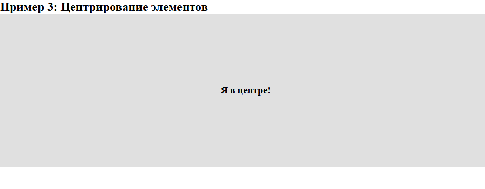

---

#### 7.4. Итоговый результат
Страница со всеми примерами применения Flexbox.

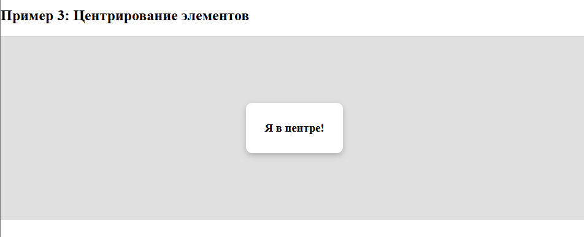

---

### 8. Git-команды
Скриншот подключения репозитория к GitHub.

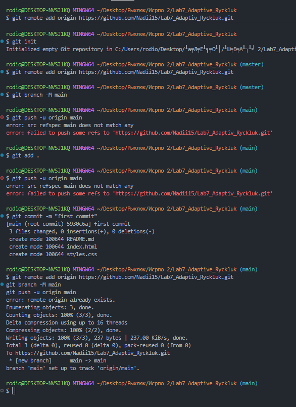

---

## Вывод
В ходе лабораторной работы были изучены основные свойства и возможности технологии Flexbox для создания адаптивных веб-страниц. Освоены ключевые свойства: `flex-direction`, `justify-content`, `align-items`, `flex-wrap`, `gap`, `flex-grow`. Созданы практические примеры: навигационное меню, карточки товаров и центрирование элемента.

---

## Используемые технологии
- HTML5
- CSS3 (Flexbox)
- Git
- GitHub
- Visual Studio Code
- Live Server